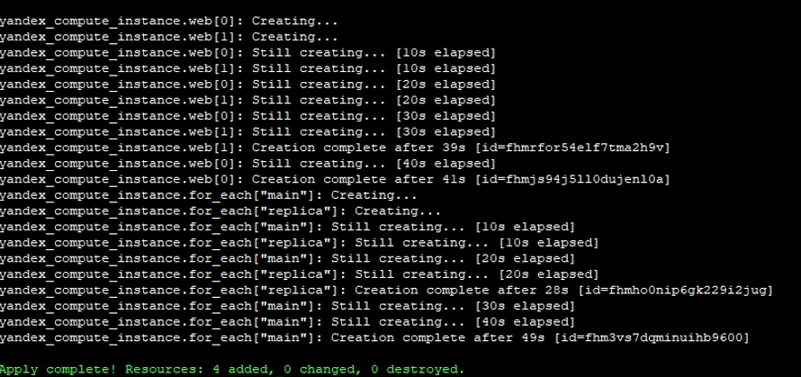
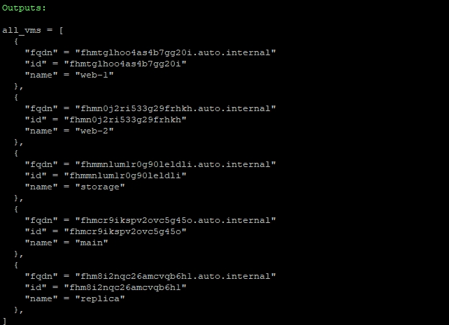

# Terraform-03
### Задание 1

Создалась сеть и подсеть с именем Develop и группа безопасности с именем example_dynamic и правилами трафика:


### Задание 2

1.Создан файл count-vm.tf и описаны 2 одинаковые виртуальные машины, которые называются web-1 и web-2 и назначена группа безопасности:

```
resource "yandex_compute_instance" "web" {
  name        = "${var.yandex_compute_instance_web[0].vm_name}-${count.index+1}"
  platform_id = var.yandex_compute_instance_web[0].platform_id

  count = var.yandex_compute_instance_web[0].count_vms

  resources {
    cores         = var.yandex_compute_instance_web[0].cores
    memory        = var.yandex_compute_instance_web[0].memory
    core_fraction = var.yandex_compute_instance_web[0].core_fraction
  }


  boot_disk {
    initialize_params {
      image_id = data.yandex_compute_image.ubuntu-2004-lts.image_id
      type     = var.boot_disk_web[0].type
      size     = var.boot_disk_web[0].size
    }
  }

  metadata = {
    ssh-keys = "ubuntu:${local.ssh-keys}"
    serial-port-enable = "1"
  }

  network_interface {
    subnet_id = yandex_vpc_subnet.develop.id
    nat       = true
    security_group_ids = [
      yandex_vpc_security_group.example.id
    ]
  }
```

2 Создан файл for_each-vm.tf. В нем опины две ВМ с именами “main” и “replica” 

```
variable "vm_resources" {
  type = list(object({
    vm_name = string
    cpu     = number
    ram     = number
    disk    = number
    platform_id = string
  }))
  default = [
    {
      vm_name = "main"
      cpu     = 2
      ram     = 2
      disk    = 5
      platform_id = "standard-v1"
    },
    {
      vm_name = "replica"
      cpu     = 2
      ram     = 2
      disk    = 10
      platform_id = "standard-v1"
    },
  ]
}

locals {
  ssh-keys = file("~/.ssh/id_rsa.pub")
}

resource "yandex_compute_instance" "for_each" {
  depends_on = [yandex_compute_instance.web]
  for_each = { for i in var.vm_resources : i.vm_name => i }
  name          = each.value.vm_name

  platform_id = each.value.platform_id
  resources {
    cores         = each.value.cpu
    memory        = each.value.ram

  }
  boot_disk {
    initialize_params {
      image_id = data.yandex_compute_image.ubuntu.image_id
      size = each.value.disk
    }
  }
```

3-4. ВМ из пункта 2.2 должны создаваться после создания ВМ из пункта 2.1.
Используйте функцию file в local-переменной для считывания ключа ~/.ssh/id_rsa.pub и его последующего

```
locals {
  ssh-keys = file("~/.ssh/id_rsa.pub")
}

resource "yandex_compute_instance" "for_each" {
  depends_on = [yandex_compute_instance.web]
  for_each = { for i in var.vm_resources : i.vm_name => i }
  name          = each.value.vm_name
```

5 Инициализируйте проект, выполните код.



### Задание 3
Создайте 3 одинаковых виртуальных диска 

```
  default = [
    {
      for_storage = {
        type       = "network-hdd"
        size       = 1
        count      = 3
        block_size = 4096
        name = "disk"
      }
    }
  ]
}

resource "yandex_compute_disk" "disks" {
  name  = "${var.storage_secondary_disk[0].for_storage.name}-${count.index+1}"
  type  = var.storage_secondary_disk[0].for_storage.type
  size  = var.storage_secondary_disk[0].for_storage.size
  count = var.storage_secondary_disk[0].for_storage.count
  block_size  = var.storage_secondary_disk[0].for_storage.block_size
}
```

Создайте в том же файле одиночную VM

```
resource = "yandex_compute_instance_storage"{
      name         = "storage"
      zone         = "ru-central1-a"
      resources = {
      cores        = 2
      memory       = 2
      core_fraction = 5
        
    }


boot_disk {
initialise_params {
image_id = data.yandex_compute_image.ubuntu-2004-lts.image_id
type = "network-hdd"
size = 5
}

metadata = {
ssh-keys = ubuntu:${local.ssh-keys}"
serial-port-enable = "1"
}

network-interface {
subnet_id = yandex_vpc_subnet.develop.id
nat = true

securite-groups_id = [
yandex_vpc_security_group.example.id
]
}
dynamic "secondary_disk" {
for_each = yandex_compute_disk.disks.*.id
content {
disk_id = secondary_disk.value
}
}
}
```


### Задание 4

1. В файле ansible.tf создайте inventory-файл для ansible. 

```
resource "local_file" "hosts_cfg" {
  content = templatefile("${path.module}/hosts.tftpl",
   {webservers =  yandex_compute_instance.web
    databases = yandex_compute_instance.for_each
    storage = [yandex_compute_instance.storage]}
  )
  filename = "${abspath(path.module)}/hosts.cfg"
}
```

2. Инвентарь должен содержать 3 группы [webservers], [databases], [storage] и быть динамическим


### Задание 5

Напишите output, который отобразит все 5 созданных ВМ в виде списка словарей:





